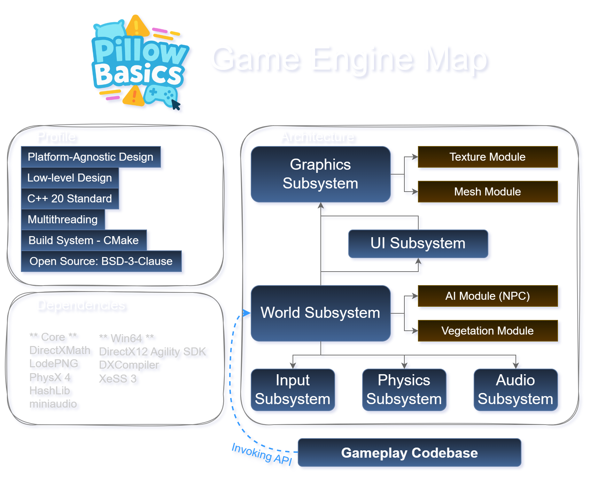

*For decades, graphical editors have become a pillar of almost all modern game engines. But what if it is not the best practice? Pillow wants to share a case first.*

> In an actual AAA project developed with Unreal 5, modifying numerous actors with similar functionality was required in a large scene containing over 10,000 actors.
> 
> These actors, created by hundreds of designers and artists across multiple studios, lacked consistent naming conventions and categories, making the editor’s batch search functionality inefficient; furthermore, severe object overlap made manual selection in the editor viewport nearly impossible with the mouse. With only one week until delivery, the schedule was extremely tight.
> 
> A small engineering team was assigned to this issue, and they found that the .umap binary scene format not only resisted direct editing but also prevented concurrent modifications by multiple users. The solution adopted was to develop Python scripts using Unreal’s Python API. However, this increased the learning curve for an already strained programming team and required repeated cross-time-zone communication with designers and artists, resulting in frequent script revisions. Consequently, a senior engineer had to work extensive overtime to deliver those Python scripts.
>
> In the after-action review, a junior engineer observed that if the scene data were in a text format such as JSON, efficient multi-user collaboration in version control could be enabled, and iteration could be significantly accelerated by leveraging powerful text editors and regular expressions.
  
## Pillow Basics: Lightweight Game Engine with a Text-Based Editor
</img>

-In%20Progress-yellow)

A lightweight C++20 game engine focusing on a text-based editor (TBE) and low-level design (LLD). TBE and LLD make PillowBasics distinct from other lightweight engines, through those advantages: 
- AI ready (for teams). Scene data in text is super friendly to an LLM, making AI integration much more productive.
- High efficiency (for designers). Through a real-time TBE, designers can create game scenes in any text editor, leveraging the power of regular expressions.
- Easy to modify (for engineers). Integrating a new module is super fast because there's no implicit coupling or overabstraction in the engine.

> Notice that the TBE can be hot-reloaded while editing a text file, and a minimal editor GUI is still available for convenience.

Moreover, other technical highlights include:
- One unified root signature; a true bindless renderer design
- **nit** is the unified luminance unit
- C++20 standard multithreading approach
- Smart pointers, no new-delete
  

## Name Convention
- Aligned with the standard C# notation.
- Classes, methods, and properties must be UpperCamelCase
- Auto variables and class fields must be lowerCamelCase.
- Directories and files must use UpperCamelCase.
  

## Getting-Started Page
[GETTING_STARTED.md](GETTING_STARTED.md)
  

## Licenses
1. PillowBasics is under the 3-Clause BSD License. 
2. Under ***"/SourceCode/3rdParty"***, each sub-folder contains 3rd-party licenses. 
3. Under ***"/SourceCode/3rdParty/EmbeddedCodeLicenses"***, licenses for internal reference code are provided; usage clarifications are provided as well.
