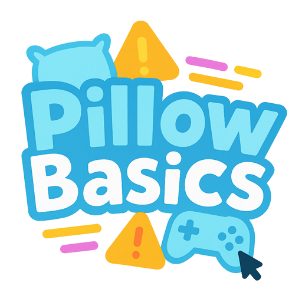

</img> 
-In%20Progress-yellow)
  
## Pillow Basics
### Description
A C++20 game engine focused on low-consumption abstract designs and eliminating software bloat in modern game development.  
### Name Convention
Aligned with the standard C# notation. Classes, methods, and properties must be UpperCamelCase, while auto variables and class fields must be lowerCamelCase. 
Folders and files MUST obey UpperCamelCase.  
### Official Getting-Started Document
[GETTING_STARTED.md](GETTING_STARTED.md)  
### Licenses
1. PillowBasics is under the BSD 2-Clause license. 
2. Under ***"/SourceCode/3rdParty"***, each sub-folder contains 3rd-party licenses. 
3. Under ***"/SourceCode/3rdParty/EmbeddedCodeLicenses"***, licenses for internal reference code are provided; usage clarifications are provided as well.
