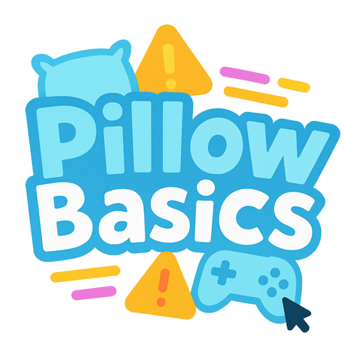

</img>
 
-In%20Progress-blue)

# Pillow Basics
## Description
A cross-platform C++ game framework focusing on low-consumption abstract designs, and dedicated to eliminating software bloat in modern game dev.

## Name Convention
Aligned with the standard notation in C#. Classes, methods, and properties must be UpperCamelCase, while auto variables and class fields must be lowerCamelCase. 
In addition, folders and files MUST obey UpperCamelCase.
